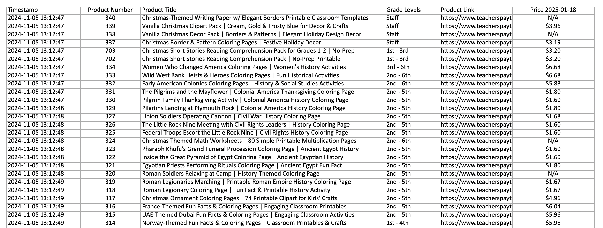
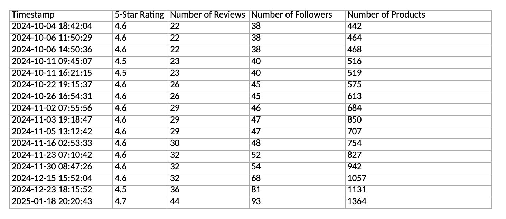

<h1 align="center"> TPT SPIDER </h1>


These two **Python** scripts enable you to scrape essential data from your **Teachers Pay Teachers (TPT)** store:

1. **`spider-1-script.py`**  
   Scrapes product titles, prices, grade levels, and links from all pages in your TPT store.

2. **`spider-2-script.py`**  
   Scrapes store-wide statistics such as 5-Star Rating, Number of Reviews, Number of Followers, and Number of Products.

---


<h2 align="center"> Table of Contents </h2>

1. [Overview](#overview)  
2. [Features](#features)  
3. [Installation & Requirements](#installation--requirements)  
4. [Usage](#usage)  
5. [Scripts Description](#scripts-description)  
6. [Data Storage](#data-storage)  
7. [Troubleshooting](#troubleshooting)  
8. [License](#license)  


---


<h2 align="center"> Overview </h2>
These scripts rely on **Selenium** and **webdriver_manager** to navigate TPT programmatically, and store data in **Excel** (XLSX) files. You can track ongoing store and product data with repeated runs.


---


<h2 align="center"> Features </h2>

- **Automated Web Scraping**: No manual effort required once set up.  
- **Excel Integration**: Outputs neatly into `.xlsx` files.  
- **Configurable**: Easily change store URLs and workbook names.  


---


<h2 align="center"> Installation & Requirements </h2>

- **Python 3.7+** (3.9 or higher recommended)  
- [Selenium](https://pypi.org/project/selenium/)  
- [webdriver_manager](https://pypi.org/project/webdriver-manager/)  
- [openpyxl](https://pypi.org/project/openpyxl/)

Install dependencies:

    ```bash
    pip install selenium webdriver-manager openpyxl
```

---


<h2 align="center"> Usage </h2>

1. **Clone or Download** this repository.
2. **Edit** each scripts `store_url` variable to match your TPT store URL.
3. **Run** one of the scripts:

    ```bash
   python `spider-1-script.py`
   python `spider-2-script.py`
   ```


--- 


<h2 align="center"> Description and Output </h2>

### `spider-1-script.py`
- **Purpose**: Scrapes product-level data (Title, Price, Grade Levels, Product Link) from all pages of your TPT store.  
- **Output**: Writes to **Spider-2-Data.xlsx**, creating or updating columns for each new scrape to track price changes over time.




---


### `spider-2-script.py`
- **Purpose**: Scrapes store-wide data (5-Star Rating, Number of Reviews, Followers, and Number of Products).  
- **Output**: Writes to **Spider-1-Data.xlsx**, appending a new row with a timestamp each time you run it.




---


<h2 align="center"> Data Storage </h2>

- **Spider-2-Data.xlsx**: Stores product-level details. Each run adds new columns for updated price info, so you can track historical changes.  
- **Spider-1-Data.xlsx**: Stores store-wide stats. Each run creates a new row with fresh metrics and a timestamp.


---


<h2 align="center"> Troubleshooting

- **Chrome Driver Issues**: Ensure that `webdriver_manager` is installed. If you’re behind a firewall, you may need special permissions.  
- **Excel File Errors**: Close the Excel file if it’s open; ensure you have read/write permissions.  
- **Selectors/Elements Not Found**: The TPT site might update its layout or class names. Inspect and adjust the scripts’ CSS selectors or XPaths as needed.


